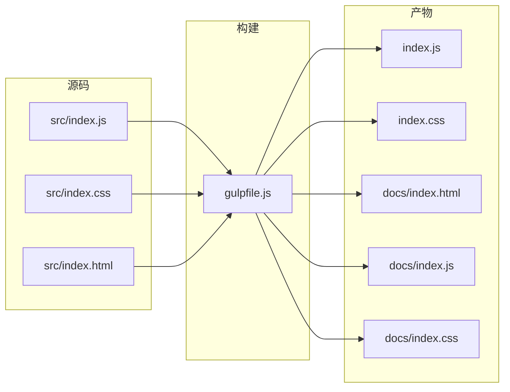

# popular-message 架构实现分析与改进建议

> 本文基于仓库现状（分支：`docs-code-reading-guide-architecture-analysis`）撰写，旨在提供对系统实现的全景分析，并给出可执行的优化 Backlog。若无特别说明，文件路径均相对于仓库根目录。

## 1. 系统概况
- **定位**：纯前端轻量级消息提示组件，提供顶部居中、自动消失的 toast 式交互。
- **主要构成**：单一 `Message` 类（Vanilla JS）、配套 CSS、Jest 单元测试、Gulp 构建脚本以及 GitHub Pages Demo。
- **发布形态**：npm 包 & CDN（压缩后的 `index.js`/`index.css`），Demo 托管在 `docs/`。

## 2. 代码分层与目录职责

| 分层/模块 | 路径 | 说明 |
| --- | --- | --- |
| 核心逻辑层 | [src/index.js](../src/index.js) | 包含 `Message` 类的实现：公共 API、消息渲染、DOM 管理、配置状态。 |
| 样式层 | [src/index.css](../src/index.css) | 控制组件外观、布局与动画，使用 BEM 风格前缀 `i-message-*`。 |
| 构建管线 | [gulpfile.js](../gulpfile.js) | 以 Gulp 为中心，负责 JS/CSS/HTML 的压缩与分发。 |
| 发布产物 | [index.js](../index.js)、[index.css](../index.css)、[docs/index.*](../docs) | 压缩后的正式输出；生产环境依赖这些文件。 |
| 测试层 | [test/index.test.js](../test/index.test.js) | 基于 Jest（JSDOM）验证核心 API、配置、模式切换与时间控制。 |
| 配置与自动化 | [package.json](../package.json)、[.travis.yml](../.travis.yml) | 定义 npm 元信息、脚本、开发依赖与 CI 流程。 |

整体架构可以抽象为“**单一业务类 + 样式 + 构建脚本**”的最小闭环，依赖极少，适合直接嵌入浏览器或 CommonJS 环境。

## 3. 核心模块与依赖关系

### 3.1 消息调用链

```mermaid
flowchart TD
    A[$message.<type>()]
    B[_message(type, args)]
    C[_render(content, duration, type, onClose, closable, dangerUseHtml)]
    D[_getContentBox()]
    E[_getMsgHtml() / _addClosBtn()]
    F[DOM & 定时器]

    A --> B --> C
    C --> D
    C --> E --> F
    C --> F
    F -->|动画结束 & setTimeout| Callback[onClose 回调]
```

- **入口**：`info/success/warning/error/loading` 将参数透传给 `_message`。
- **渲染控制**：`_render` 负责处理单例模式、倒计时、关闭按钮等逻辑。
- **视图构建**：通过 `document.createElement` 动态生成 DOM，并插入到全局唯一的 `contentBox` 中。
- **异步边界**：`setTimeout` 控制自动关闭；关闭动画依赖 CSS 动画时长（`--animate-duration: 0.4s`）。

### 3.2 构建与分发流程



- **压缩工具**：`gulp-uglify`、`gulp-clean-css`、`gulp-htmlmin`。
- **产物同步**：JS/CSS 同时输出到仓库根目录与 `docs/`，便于 npm 包与 Demo 共用。

## 4. 第三方依赖与替代方案

| 依赖 | 类型 | 用途 | 备注/替代方案 |
| --- | --- | --- | --- |
| `gulp` 4.0.2 | 开发依赖 | 构建与压缩任务编排 | 可替换为更轻量的 `npm scripts + esbuild/rollup`，减少依赖链。 |
| `gulp-clean-css` | 开发依赖 | CSS 压缩 | 若迁移到 rollup，可使用 `rollup-plugin-css-only` + `cssnano`。 |
| `gulp-uglify` | 开发依赖 | JS 压缩 | 可用 `terser` 或 `esbuild` 替代以提升性能。 |
| `gulp-htmlmin` | 开发依赖 | Demo HTML 压缩 | 若 Demo 不再压缩，可移除或改用 `html-minifier-terser`。 |
| `jest` 26 | 开发依赖 | 单元测试（含 JSDOM） | 长期需关注 JSDOM 版本升级，或迁移至 Jest 29+。 |
| `coveralls` | 开发依赖 | 上传覆盖率报告 | 若 CI 迁移至 GitHub Actions，可改用官方 Coveralls Action。 |

仓库对运行时无第三方依赖，使用纯浏览器 API，因而体积小且易嵌入。

## 5. 数据与控制流分析

1. **配置流**：`config()` 合并传入配置并立即调用 `_setContentBoxTop()` 调整距离顶部的偏移；配置存储在实例字段 `_default` 中。
2. **消息生命周期**：
   - 创建阶段：调用 `_getMsgHtml()`（必要时对 content 进行 HTML 转义）→ 插入 `contentBox`。
   - 激活阶段：依据 `duration` 注册 `setTimeout`，并在 `closable=true` 时添加按钮监听。
   - 销毁阶段：`_removeMsg()` 设置离场动画并在 400ms 后移除节点；单例模式下通过覆盖 `innerHTML` 清空其它消息。
3. **异步边界**：使用 `setTimeout` 控制生命周期，无 Promise/async 参与；动画结束时间与 `setTimeout` 间隔需保持一致，以免出现 UI 与状态不同步。
4. **全局状态**：
   - `_contentBoxId` 在构造函数中生成一次并持久化；在 CommonJS 环境下通过单例 `module.exports = new Message()` 保证全局唯一性。
   - `_default` 作为实例级配置，部分字段仅通过 `config` 设置（`singleton`）或构造函数默认值（`dangerUseHtml`）。

## 6. 性能、可维护性与可观测性评估

- **性能**：
  - 渲染链路仅进行简单的 DOM 创建和插入，复杂度 O(1)，性能瓶颈主要来自动画与 SVG 渲染。
  - 使用 `innerHTML` 组装节点，字符串模板简单但每次都会重新解析 SVG，可考虑缓存。
- **可维护性**：
  - 代码集中在单一文件，结构扁平，容易入门但缺乏模块边界。
  - `_default` 状态与配置选项未完全同步（例如 `dangerUseHtml` 无法通过 `config` 设置），存在隐式约束。
  - `_message` 的参数展开对 `undefined` 缺乏防御，潜在运行时异常。
- **可测试性**：
  - Jest 测试覆盖核心行为，但缺少对 `dangerUseHtml`、`destroy` 场景的验证。
  - 缺乏对动画/定时器边界（例如 0 duration + closable）的更多断言。
- **可观测性**：
  - 未提供日志或监控钩子，仅依赖调用方控制台；如需在生产中追踪消息埋点，需要额外扩展。
- **安全性**：
  - 默认会对内容转义，安全性较好；当开启 `dangerUseHtml` 时需呼叫方自行保证输入可控。
- **配置管理**：
  - 全局配置不可分环境管理；CI 中 `.travis.yml` 固定运行 `yarn coveralls`，若迁移 CI 工具需同步更新流程。

## 7. 风险与技术债

1. **`_message` 对第二参数的对象展开缺乏保护**：字符串调用时会触发 `TypeError`（`{...undefined}`）。当前通过测试尚未暴露，推测历史版本中使用了 Babel 或兜底，但在现代 Node 中会抛错。
2. **`_resetDefault` 未恢复 `singleton` 与 `dangerUseHtml`**：调用 `destroy()` 后若期望恢复默认单例/HTML 设置，会出现状态残留。
3. **`config()` 无法设置 `dangerUseHtml`**：默认值放在 `_default` 中，却未在 `config` 中暴露，导致全局默认值无法配置。
4. **构建链依赖 Gulp 老版本**：潜在安全补丁更新滞后，且与现代工具（ESM、Tree Shaking）无缝接入难度大。
5. **CI 覆盖率流程与脚本不一致**：`.travis.yml` 调用 `yarn coveralls`，而脚本 `coveralls` 中混合使用 `jest --coverage --coverageReporters=text-lcov | coveralls`，在某些环境可能出现 pipe 失败或权限问题。
6. **缺乏 Type Definition**：对 TS/现代 bundler 用户不够友好，需要额外编写声明文件。

## 8. 可执行优化 Backlog

| # | 改进目标 | 预期收益 | 工作量预估 | 实施要点 | 验收标准 |
| --- | --- | --- | --- | --- | --- |
| 1 | 修复 `_message` 对字符串参数的兼容性 | 避免运行时异常，提升稳定性 | S | 检查 `args[1]` 是否存在再展开；补充对应单元测试 | `yarn test` 通过；新增测试覆盖字符串单参调用 |
| 2 | 扩充 `_resetDefault` 与 `config` 支持所有默认字段 | 统一配置状态，减少隐式副作用 | S | 将 `_default` 的完整结构抽取常量，`config` 做合并；`destroy` 调用完整重置 | 测试验证 `singleton`、`dangerUseHtml` 重置行为 |
| 3 | 缓存 SVG 字符串或改为静态常量 | 减少重复字符串拼装，提高渲染效率 | S | 将 icon map 提升为类静态属性或模块常量 | Lighthouse demo 测试时多次调用无性能退化；单元测试通过 |
| 4 | 引入 Rollup/Vite 等现代构建工具 | 降低构建时间与依赖数量，支持 ESM/CommonJS 多格式发布 | M | 新增构建配置输出 `cjs`、`esm`、`umd`；保留旧 Gulp 任务直至完成迁移 | 发布产物经 `npm pack` 验证可用；CI 构建通过 |
| 5 | 增强单元测试覆盖率（`dangerUseHtml`、`destroy`、`duration=0` 等场景） | 提升回归信心，覆盖关键边界 | S | 为不同配置编写独立测试用例；使用 `jest.advanceTimersByTime` 验证回调 | `yarn test --coverage` 覆盖率提升并稳定 |
| 6 | 提供 TypeScript 声明文件 (`index.d.ts`) | 改善开发者体验，方便 TS 项目集成 | M | 手写类型，覆盖 API、配置项；在 `package.json` 中声明 `types` | 通过 `tsc --noEmit` 示例验证；发布包内含 `index.d.ts` |
| 7 | 迁移/补充 CI 流程至 GitHub Actions 并引入 Lint/格式检查 | 提升可观测性与质量门禁 | M | 新增 GHA workflow：安装依赖、运行 test/coverage、可选 ESLint/Prettier | CI 成功运行，文档记录迁移步骤 |
| 8 | 为 Demo 添加交互脚本与自动化测试（可使用 Playwright） | 覆盖真实用户路径，保障发布质量 | L | 编写 Demo 脚本展示各 API；配置 Playwright headless 测试 | Playwright 测试稳定；CI 中集成 |

> 建议优先完成 #1 和 #2，风险最高且改动较小；随后按资源投入程度推进构建链迁移与测试增强。

## 9. 总结
popular-message 以极简设计提供了开箱即用的消息提示能力，但当前仍停留在“单文件 + 脚本构建”的形态。通过补齐参数防御、统一配置、现代化构建与测试体系，可显著提升稳定性与可维护性，同时为未来的功能拓展（如多主题、无障碍支持、TypeScript 适配）打下基础。建议团队按照 Backlog 的优先级逐步实施，并在每个阶段记录变更影响与回滚方案。
