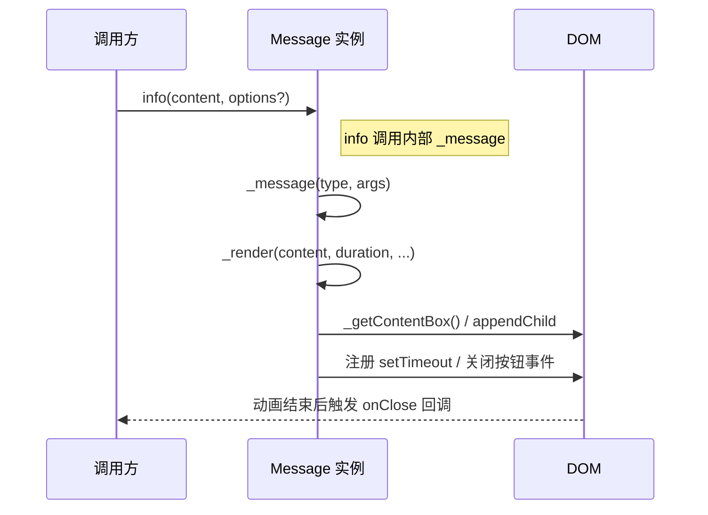

# popular-message 代码阅读指南

> 本指南面向首次接手 popular-message 项目的开发者，帮助你在最短时间内理解仓库结构、阅读顺序以及常见注意事项。阅读完本文，你应当能够本地运行示例、快速定位核心逻辑并自信地着手修改或扩展功能。

## 1. 快速上手

### 1.1 环境要求
- Node.js ≥ 14（Travis CI 采用的版本），建议使用 LTS 版本保证包管理工具兼容性。
- 建议安装 **Yarn**（项目脚手架脚本以 yarn 为主），亦可使用 npm。

### 1.2 安装与运行
1. 安装依赖：`yarn install` 或 `npm install`
2. 运行单元测试（基于 Jest + JSDOM）：`yarn test`
3. 构建压缩产物（会同步输出到仓库根目录和 docs 目录）：`yarn build`
4. 预览示例：构建后打开 [docs/index.html](./index.html) 即可在浏览器查看效果。

> **调试小贴士**：构建命令会覆盖根目录下的 `index.js`、`index.css`。若要对源码进行断点或日志调试，请直接修改 `src` 目录中的文件，再通过 `yarn build`/`npx gulp` 得到最新产物。

## 2. 目录结构与职责
下表按职责划分了主要目录与文件，并给出快速说明：

| 职责分组 | 路径 | 说明 |
| --- | --- | --- |
| 核心源码 | [src/index.js](../src/index.js) | **Message** 类的完整实现（包含 API、DOM 操作、配置管理等），是阅读与修改的首要文件。 |
| 样式 | [src/index.css](../src/index.css) | Messages 的样式定义，涵盖动画、对齐、icon 尺寸等。构建后压缩为根目录及 docs 下的 `index.css`。 |
| 构建脚本 | [gulpfile.js](../gulpfile.js) | Gulp 任务：JS/ CSS 压缩与 Demo HTML 最小化，产物输出到 `docs/` 与根目录。 |
| 分发入口 | [index.js](../index.js) / [index.css](../index.css) | 由 Gulp 生成的压缩文件，供 npm 包与 CDN 发布；阅读时以 `src` 目录为准。 |
| 文档与 Demo | [docs/](../docs) | GitHub Pages 静态演示站点（`index.html`/`index.js`/`index.css`）以及本文档与架构分析。 |
| 测试 | [test/index.test.js](../test/index.test.js) | 覆盖 icon 颜色、API 调用、配置、单例模式等关键路径，基于 Jest 的 JSDOM 环境。 |
| 配置/环境 | [package.json](../package.json) | npm 包元数据、脚本、开发依赖定义。 |
| CI 配置 | [.travis.yml](../.travis.yml) | Travis CI 配置，当前执行 `yarn coveralls` 以产生覆盖率报告。 |
| 说明文档 | [README.md](../README.md) / [README-zh.md](../README-zh.md) | 项目介绍、安装用法与 API 说明，是了解业务背景的起点。 |

## 3. 阅读顺序建议

1. **README-zh.md**：了解项目定位、对外 API 与使用方式。
2. **src/index.js**：聚焦 `Message` 类的构造与公开方法（`info`/`success` 等），弄清与外部交互的接口。
3. **src/index.css**：掌握 UI 与动画如何命名及适配，便于后续调试样式或新增状态。
4. **test/index.test.js**：通过测试用例佐证预期行为，理解边界条件（例如单例模式、自动销毁逻辑）。
5. **gulpfile.js** 与 **package.json**：澄清构建产物生成逻辑及脚本入口，理解 npm 包的输出形式。

以下时序图概括了 `$message.info()` 的执行链路，可作为阅读源码时的参考导航：

## 4. 核心模块导读

### 4.1 公共 API（对外暴露）
- `info / success / warning / error / loading`：统一委托到 `_message`，根据类型切换 icon 与样式。
- `config(options)`：修改默认展示位置、停留时长与是否启用单例模式。调用后会立即更新已有容器位置。
- `destroy()`：移除当前消息容器并重置默认配置，常用于测试或释放资源。

相关代码位置：`src/index.js` 的 12~41 行。

### 4.2 内部渲染链路
- `_message(type, args)`：解析参数（字符串模式 / 对象模式），并扩展额外配置后交由 `_render`。
- `_render(...)`：负责生成 DOM、处理单例/多例模式逻辑、注册定时销毁与关闭按钮事件。
- `_removeMsg(...)`：执行离场动画并在 400ms 后移除节点，触发 `onClose` 回调。

相关代码位置：`src/index.js` 的 48~99 行。

### 4.3 DOM 与视图协作
- `_getIcon(type)`：返回内嵌 SVG，以颜色区分状态。
- `_getMsgHtml(type, content, dangerUseHtml)`：构建消息容器节点，必要时先对内容进行 HTML 转义。
- `_addClosBtn(messageDOM, remove, timer)`：插入关闭按钮并清理倒计时。
- `_getContentBox()`：获取或创建顶层容器，默认生成随机 `id` 并附加 `.popular-message`。

相关代码位置：`src/index.js` 的 101~186 行。

### 4.4 配置与状态管理
- `_getContentBoxId()`：确保容器 `id` 全局唯一。
- `_setContentBoxTop()`：更新容器的 `top` 样式，响应 `config` 调用。
- `_resetDefault()`：恢复默认配置（注意当前仅恢复 `top` 和 `duration`）。

相关代码位置：`src/index.js` 的 188~217 行。

## 5. 运行与调试建议

- **单元测试调试**：运行 `yarn test --watch`; 使用 `console.log` 或 `debugger`，Jest 会使用 JSDOM 模拟浏览器环境，可直接操作 `document`。
- **浏览器调试**：执行 `yarn build` 后打开 `docs/index.html`，在 DevTools 中观察 DOM 结构和动画。可通过 `window.$message` 手动调用 API。
- **局部样式调试**：在 `src/index.css` 添加临时类名后构建，即可在 Demo 页面验证效果。
- **脚本调试**：`gulpfile.js` 较短，可使用 `node --inspect-brk node_modules/gulp/bin/gulp.js` 启动带断点的构建流程。

## 6. 常见坑位

1. **字符串调用的参数展开**：`_message` 对第二个参数执行对象展开，若未传入对象，需要先补齐默认值以避免运行时异常（这是当前版本的技术债之一，详见架构分析文档）。
2. **`dangerUseHtml` 选项**：开启后会跳过转义，务必确保外部内容可控以防 XSS。
3. **`destroy()` 重置范围有限**：仅恢复 `top`/`duration`，`singleton` 与 `dangerUseHtml` 需手动还原。
4. **构建产物覆盖问题**：执行 `yarn build` 会覆盖根目录的 `index.js`/`index.css`，请勿直接在压缩文件上修改。
5. **CI 依赖 Yarn**：Travis 脚本调用 `yarn coveralls`，若仅安装 npm 可能导致 CI 失败。

## 7. 术语表

| 术语 | 定义 | 关联代码/位置 |
| --- | --- | --- |
| `$message` | 对外暴露的消息实例（CommonJS `module.exports` 或浏览器全局 `window.$message`） | [src/index.js](../src/index.js) 219~223 行 |
| `singleton` | 单例模式，开启后同一时刻只展示一条消息 | `config()` 与 `_render()` 内的 `this._default.singleton` |
| `dangerUseHtml` | 是否将内容视作 HTML 直接插入（未转义） | `_getMsgHtml()` |
| `contentBox` | 用于承载所有消息的顶层容器，类名 `.popular-message` | `_getContentBox()` |
| `closable` | 是否渲染可手动关闭的按钮 | `_render()` / `_addClosBtn()` |
| `onClose` | 消息关闭回调，动画结束后触发 | `_removeMsg()` |

---

通过以上路径和提示，你应该能够在 30~60 分钟内完成本仓库的首次代码阅读。如需更深入的改进与风险分析，请继续参阅 [architecture-analysis.md](./architecture-analysis.md)。
